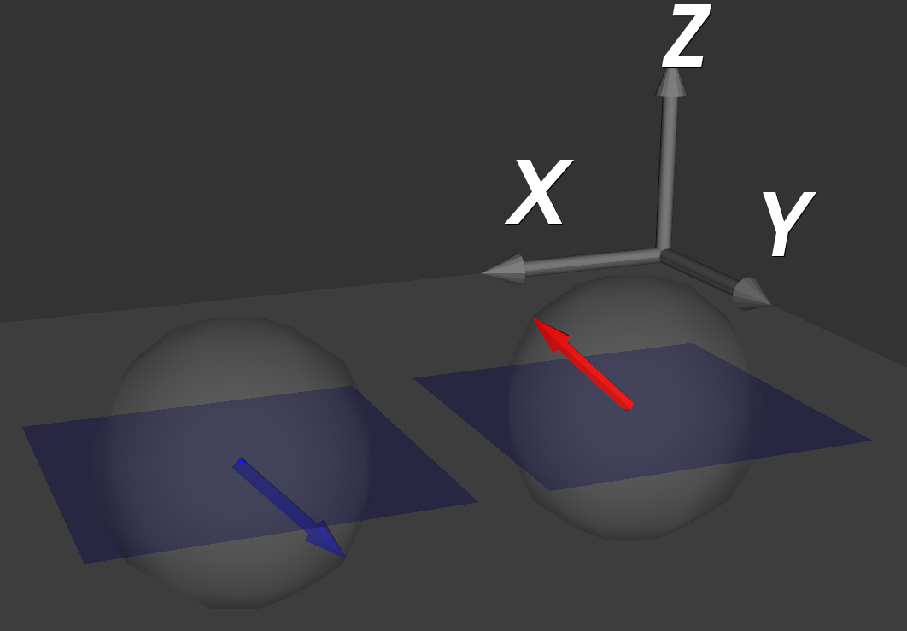
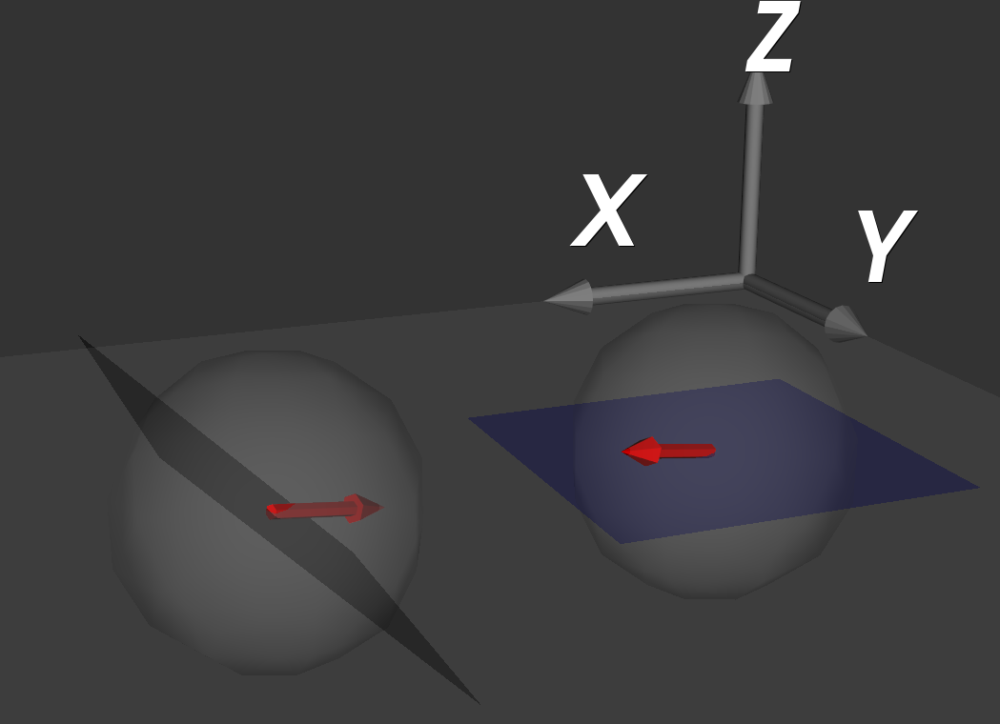
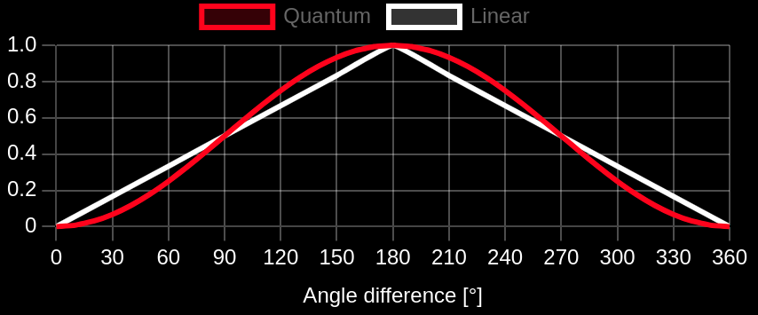
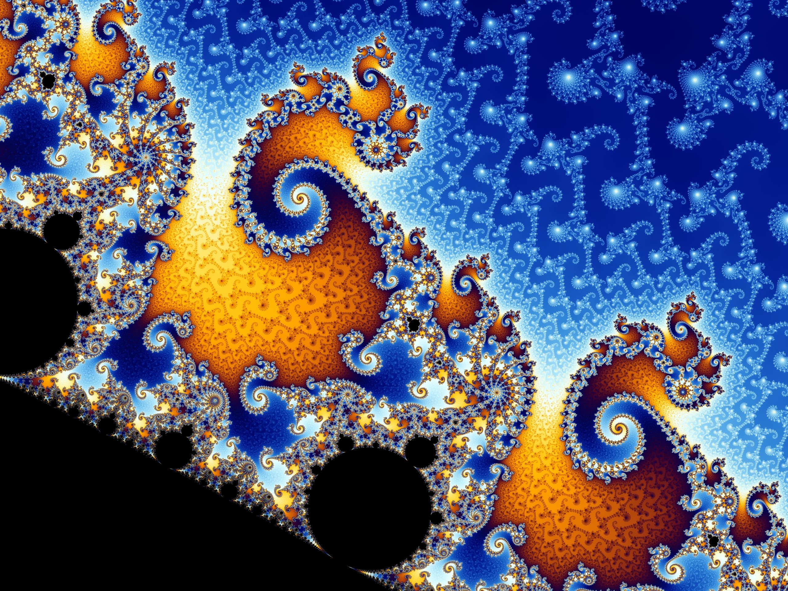

# Solving quantum mechanics mystery

## 1. Abstract

I am surprised by a scientist accepting the fact that there could be any fundamentally random event. Accepting randomness does not sound scientific. The most widely accepted interpretation of quantum mechanics[1] seems to be the Copenhagen collection of views. The Copenhagen interpretation of quantum mechanics tells us that when we do a mesurement, the wave function collapse is fundamentally random. Let's discuss a simple quantum experiment and understand why we try to hide quantum mechanics mystery under the randomness. Such an experiment could be CHSH game[2].

## 2. Theoretical introduction

Before describing the CHSH game, let's start with a recall of crucial concepts related to the topic. 

`Locality`: an object is influenced directly only by its immediate surroundings. Causes must travel through spacetime at the speed of light or slower to affect other energies or objects.

`Realism`: objects which accord with the principle of realism have defined properties independent of our measurements. The universe exists external to our minds and exists whether or not we observe or measure it.

`Determinism`: the philosophical belief that all events, including moral choices, are determined completely by previously existing causes. In a deterministic system, given a specific set of initial conditions and laws of nature, the outcome can be predicted with certainty.

`Superdeterminism`: in addition to being deterministic, superdeterministic models also postulate correlations between the state that is measured and the measurement setting.

`Randomness`: refers to the lack of pattern or predictability in events. In a random system, outcomes cannot be predicted with certainty, even if the initial conditions are known. Randomness, also known as indeterminism, is the opposite of determinism.

`Spin`: Electrons (and many other fundamental particles) possess an intrinsic angular momentum called spin. Spin is a quantum mechanical property, and for electrons, it can have two possible values: spin-up (|↑⟩) or spin-down (|↓⟩).

`Superposition`: A fundamental principle in quantum mechanics is superposition. A particle can exist in multiple states simultaneously.

`Entanglement`: Two or more particles can become interconnected in a way that their states are no longer independent. They are said to be entangled.

`Tensor Product (⊗)`: The tensor product is used to describe combined quantum systems. For example, |↑⟩₁|↓⟩₂ represents a two-electron system where electron 1 is spin-up and electron 2 is spin-down.

`Two-electron system`: System of two electrons where each electron can be in either the spin-up or spin-down state, resulting in four possible combinations for the system.

`Singlet state`: pair of spin-1/2 particles fullfiling two conditions: 1) whenever the first particle is measured to be spin up on some axis, the other, when measured on the same axis, is always found to be spin down;
2) the prior probabilities for measuring each value of spin (up and down) are equal.

`Spin Angular Momentum (S)`: An intrinsic property of particles, independent of their spatial motion. It's like a particle spinning around its own axis. 

`Spin operator`: describes the spin angular momentum of a particle. Such an operator is applied to a mathematical representation of the physical state of a system and yields an angular momentum value if the state has a definite value for it.

`Spin Rotation operator R(θ)`: It represents a rotation of the spin state of the particle by an angle θ about an axis in the x-y plane. This rotation doesn't change the overall magnitude of the spin, but it changes its orientation in space. The specific form of R(θ) follows from the general principles of how rotations are represented in quantum mechanics. For spin-1/2 systems, 2x2 matrices act on the two-dimensional state vector.

`Unitary Operation`: The rotation operator is a unitary operator. This means that it preserves the normalization of the quantum state (i.e., the probability of finding the particle in a particular state remains 1).

Having a singlet state we can easily create a classical image of a case when we measure spins of both particles on the same axis. We can visualize such case on a 3D projection where a spin is an arrow pointing to any point of a sphere. The measurement plane is a 2D surface. If a pointer of an arrow is above the surface we did measure a spin up (red color). Otherwise, we did measure a spin down (blue color). Lets visualize a simple case when we measure both particles without any rotation (measurment angles difference = 0 degrees, Figure 1.). The left particle (sphere on the left side of the image) has been measured with spin down (blue). The right particle has been measured with spin up (red).


Figure 1. Classical visualization of singlet state measurements without angle difference. 

Without any angle difference the values of measured singlet state spins are always opposite. It is clear and it does work in the same way in both, classical and quantum considerations. Figure 2 shows a classical visualization of our measurement experiment in case of rotating one of the measurement devices by 45 degress around Y-axis. There are cases (like in Figure 2) when spins are measured in such a moment where the rotation angle leads to the same spin value measurement (both up, red color). Performing multiple measurments with such a rotation on multiple singlet states we do not always end up with opposite spin values. When we plot reasults of those multiple measurements we end up with a linear correlation between spin equality and the rotation angle (see Figure 3, linear correlation).


Figure 2. Classical visualization of singlet state measurements with angle difference equals 45 degrees.


Figure 3. Correlation between singlet state spins as a function of angle difference between mesurement devices.

The magical things happens when we actually perform such multiple experiments on multiple singlet states and plot a correlation chart. On the plot we see that the correlation is described by the following forumula: `sin²(θ/2)` (see Figure 3, quantum correlation). One can ask, what is magical with that? Its just another formula, not a linear, but trigonometric. The formula indicates that we experience a correlation that is not possible in the local and real classical point of view. We are not able to create such a classical setup when we get stronger correlation that the linear one that we have presented. For the quantum setup we can separate the particles from a single state hundreds kilometers away and still get the correlations described by `sin²(θ/2)`. Its worth to underline, that we do not observe any data exchange faster than light (actually it should be instant data exchange, based on the experiments results). But we do observe correlations that works without carrying about the distance. The famous statement about "spooky action at a distance" is a bit misleading. It should rather be "spooky correlation at a distance". We are not able to send any data faster than light in such a quantum setup.

The results of quantum experiments requires that we reject the assumptions of, at least one of the following:

- locality
- realism

Based on the Copenhagen interpretation there are no non-local interactions. What we do observe are non-local correlations, which tend to be stronger than non-local correlations in classical physics. The famous quantum entanglement is an inherently local phenomenon because for the entanglement itself to happen, both particles must be in a direct neighborhood. Since locality in such interpretation is safed, we must reject the realism. What does it mean? It means that without an interaction, any quantum objects or group of objects described by wave function are not a physical thing. They are just a "potential physical things" with a given probabilities to get real at the moment of interaction (its called wave function collapse). Moreover, the result of a collapse is fundamentally random. It cannot be deduce from any "hidden variables" or other missing data. Sticking with a localism we sacrifice causation.  “Do you really believe the moon is not there when you are not looking at it?” Einstein once asked to underline his doubts in the realess interpretation.

The concept of magically strong correlations can be presented in the more understandable form of a CHSH game [3]:

Let's imagine a game in which our opponent prepares three cards that are invisible to us and claims the following statements:

1) The first and second cards are the same suit
2) The second and third cards are the same suit
3) The first and third cards are different suits

Our task is to determine which of these statements is false. We indicate any two cards, and our opponent reveals them. If the revealed cards contradict the statement that refers to them, we win $2. If they agree, we lose $1.

It is easy to see that all three statements cannot be true. Even if we choose the cards to reveal completely randomly, we have a 1/3 chance of detecting a false statement. Our expected value for this game is:

`1/3 x 2$ + 2/3 x (-1$) = 0`

To prevent the opponent from cheating, we introduce the following modification: the opponent must prepare two copies of the cards and send them to his helpers: Alice and Bob. We ask the first helper for one card, and the second helper for the other. To physically prevent these helpers from communicating with each other, we place them far apart and ask them simultaneously - requiring the answer immediately, so that they do not have time to send the information we asked to each other, even at the speed of light. To ensure that they get identical sets of cards, we are given the opportunity to ask them about the same card and, for example, we determine that if the answers are different, we win $1,000,000. With such a punishment we can be sure the opponent do not cheat.

Even if the opponent does not give the helpers fixed answers, but only some instructions on how to answer, the helpers must provide the card suits based only on these instructions and the number of the card we are asking about. It can be shown that no set of instructions gives the opponent the possibility of winning.

Bell showed that, according to quantum mechanics, the opponent can create a quantum setup what will allow him to win.

This is done as follows: the opponent prepares a singlet state with the assumption that one of the observers, e.g. Bob, after measuring the local value of the spin component always changes the sign of the experimentally obtained value.

The particles are sent in the form of successive pairs to Alice and Bob, each of them receiving one of the given pair. For each pair, they perform measurements of a certain spin component of their particle.

It can be calculated that if they measure the spin components of these two particles along different axes, then depending on the angle between these axes, the results of the two measurements are related to each other:

- if the axes are at an angle of 60° to each other – the probability of an identical result (after Bob's sign swap) is 3/4 (see Figure 3, quantum correlation),
- if the axes are at an angle of 120° to each other – the probability of an identical result is 1/4.

Particle A is sent to Alice, and particle B to Bob. The helpers treat the questions about the individual cards as instructions on which axis to measure the spin value of their particle. They agree in advance that their measurements will only be in a certain fixed plane, e.g. XY, where the Y direction is vertical and the X direction is horizontal.

- Question about the first card: along an axis tilted from the vertical (Y) to the left by 60°.
- Question about the second card: along the vertical axis (Y).
- Question about the third card: along an axis tilted from the vertical (Y) by 60° to the right.

The helpers give us the colors of cards according to the result (e.g. red if the measurement gave an upward spin and black if it gave a downward spin).

As a result, the helpers' answers are correlated in the following way:

- If we ask about the same card - the probability of an identical result is 100% (our chance of winning is 0%). But we can always ask without any consequences just to verify the liability of the opponent.
- If we ask about adjacent cards - the probability of an identical result is 75% (our chance of winning is 25%).
- If we ask about the first and third cards - the probability of an identical result is 25% (our chance of winning is 25%).

Thus, on average, our expected value of the game (when we do not ask for the same card) is:

`1/4 x 2$ + 3/4 x (-1$) = -1/4$`

(this formula holds for both the case of asking for adjacent cards and for the first and third cards). This means that, contrary to our earlier claims, the opponent has a winning strategy when playing the game multiple times.

This contradiction with the common-sense proof that our expected value of the game is nonnegative is precisely an example of a violation of Bell's inequality[4]. Although the helpers cannot communicate with each other, entangled pairs give them the possibility of correlating their behaviors sufficiently to win the game.

## 3. CHSH game optimal strategy derivation

We consider a maximally entangled pair of qubits (EPR pair). The probability of finding both qubits with the same state depends on the angle between measurement settings.

Why this dependency is described by the following equation?

`P(same spin) = sin²(θ/2)`

### Entangled Singlet State

Electrons are fermions, which means they obey the Pauli Exclusion Principle. This fundamental principle states that no two identical fermions can occupy the same quantum state simultaneously.

The quantum state of a particle encompasses not only its position but also intrinsic properties like spin.  So, two electrons cannot be in the same location and have the same spin state.

The Pauli Exclusion Principle translates into a mathematical requirement for the wavefunction describing a system of fermions: it must be antisymmetric under the exchange of particles.

Each electron in our system can exist in a superposition of spin-up (`|↑⟩`) and spin-down (`|↓⟩`) states. For two electrons, the possible combined states are:

- `|↑₁⟩|↑₂⟩` (Both spin-up)
- `|↑₁⟩|↓₂⟩` (Electron 1 spin-up, Electron 2 spin-down)
- `|↓₁⟩|↑₂⟩` (Electron 1 spin-down, Electron 2 spin-up)
- `|↓₁⟩|↓₂⟩` (Both spin-down)

The singlet state is defined by having a total spin of zero. Because electron spins have values of 1/2,  the only way to combine their spins to get zero is if they're in opposite states. This eliminates the first and last possibilities from the list above.

The quantum state of a singlet is antisymmetric under exchange. What does "antisymmetric under exchange" mean? If you swap the labels of the two electrons (1 and 2) in the wavefunction, the wavefunction changes its sign.

Now, we need to combine the remaining two possible states in a way that makes the wavefunction antisymmetric:

- If we simply add them, the wavefunction is symmetric: `|↑₁⟩|↓₂⟩` + `|↓₁⟩|↑₂⟩` (Doesn't change sign if we swap 1 and 2)
- To make it antisymmetric, we subtract them: `|↑₁⟩|↓₂⟩` - `|↓₁⟩|↑₂⟩`.  Now, swapping the electron labels changes the sign of the wavefunction.

The only way to construct a valid wavefunction with opposite spins and satisfy the antisymmetry requirement is by making a linear combination where the two possible configurations have opposite signs.

Finally, in Dirac notation the state has the following representation:
```
|Ψ⟩ = (1/√2) ( |↑₁⟩|↓₂⟩ -  |↓₁⟩|↑₂⟩)
```

### Rotated Spin Measurement

Unlike in more complicated quantum mechanical systems, the spin of a spin-1/2 particle can be expressed as a linear combination of just two eigenstates, or eigenspinors. These are traditionally labeled spin up and spin down.

The Pauli matrices are a set of three 2x2 matrices that are essential in describing the spin of particles like electrons:
```
σx = ( [0 1] [1 0] )
σy = ( [0 -i] [i 0] )
σz = ( [1 0] [0 -1] )
```

If we use the column vector representation of the various spin eigenstates, then we can use the following representation for the spin operators:
```
Sz = (ħ/2)σz = (ħ/2) * ( [1  0]
                         [0 -1] )

Sₓ = (ħ/2)σx = (ħ/2) * ( [0  1]
                         [1  0] )
```

#### Rotation Operator (in the x-y plane)

Rotations are intricately linked to angular momentum. The angular momentum operators (Sx, Sy, Sz for spin systems) are considered the 'generators'  of rotations. This means infinitesimal rotations around a specific axis can be expressed in terms of the corresponding angular momentum operator.

A powerful mathematical result tells us how to build a finite rotation from infinitesimal ones: If we have a generator of rotations, G, then a rotation by an angle θ around the axis associated with G can be represented as:

```
R(θ) = exp(-iθG / ħ)
```

The angular momentum operator for the z-axis is Sz. Similarly, the rotation operators about the x-axis and y-axis can be derived using their corresponding angular momentum operators (Sx and Sy):

```
Rz(θ) = exp(-iθσz / 2)
Rx(θ) = exp(-iθσx / 2)
Ry(θ) = exp(-iθσy / 2)
```

To get the rotation operator in the x-y plane, we need a combination of rotations about different axes.  One way to achieve this is:

Rotate about the z-axis by an angle of π/2.  
Rotate about the y-axis by an angle of θ.  
Rotate about the z-axis by an angle of -π/2.  

The combined rotation operator is the product of these individual rotation operators:
```
R(θ) = Rz(-π/2) Ry(θ) Rz(π/2)
```
If you calculate the matrix multiplications (using the exponential forms of the rotation matrices and the properties of Pauli matrices), you will arrive at exactly the structure shown:

```
R(θ) =  [ cos(θ/2) -sin(θ/2) ]
        [ sin(θ/2)  cos(θ/2) ]
```

#### Spin Operator Along Rotated Axis (Sθ)
```
Sθ = R(θ) Sz R⁻¹(θ) 

Sθ =  (ħ/2) * [ cos(θ/2)  sin(θ/2) ]
              [ sin(θ/2) -cos(θ/2) ]
```
#### Eigenstates of Sθ

```
|↑(θ)⟩ = [ cos(θ/2) ]
         [ sin(θ/2) ]

|↓(θ)⟩ = [-sin(θ/2) ]
         [ cos(θ/2) ]  
```

### (TODO JBIEL review) step by step deriviation for P(same spin)

```
P(same spin) = P(↑₁↑₂) + P(↓₁↓₂)

P(up-up) = P(↑₁↑₂) = |(⟨↑₁(θ)| ⊗ ⟨↑₂|)|Ψ⟩|² 
```

The singlet state of two spin-1/2 particles (electrons) is given by:

```
|Ψ⟩ = (1/√2) [ |↑₁⟩|↓₂⟩ − |↓₁⟩|↑₂⟩ ]
```

#### Define the Measurement States

We are measuring the spins along different axes:

- **For Particle 1**: Measured along an axis rotated by an angle θ in the x-y plane. The eigenstates are:

  ```
  |↑₁(θ)⟩ = cos(θ/2) · |↑₁⟩ + sin(θ/2) · |↓₁⟩

  |↓₁(θ)⟩ = −sin(θ/2) · |↑₁⟩ + cos(θ/2) · |↓₁⟩
  ```

- **For Particle 2**: Measured along the original z-axis. The eigenstates are `|↑₂⟩` and `|↓₂⟩`.

#### Compute the Probability \( P(↑₁↑₂) \)

We want to compute:

```
P(↑₁↑₂) = | ⟨↑₁(θ)| ⊗ ⟨↑₂| Ψ⟩ |²
```

#### Expand ⟨↑₁(θ)| ⊗ ⟨↑₂|

```
⟨↑₁(θ)| ⊗ ⟨↑₂| = [ cos(θ/2) · ⟨↑₁| + sin(θ/2) · ⟨↓₁| ] ⊗ ⟨↑₂|
```

#### Apply to the Singlet State

```
⟨↑₁(θ)| ⊗ ⟨↑₂| Ψ⟩ = (1/√2) [ ⟨↑₁(θ)| ⊗ ⟨↑₂| ( |↑₁⟩|↓₂⟩ − |↓₁⟩|↑₂⟩ ) ]
```

#### Compute Inner Products

Compute each term separately.

**First Term:**

```
⟨↑₁(θ)| ⊗ ⟨↑₂| |↑₁⟩|↓₂⟩ = [ cos(θ/2) · ⟨↑₁|↑₁⟩ + sin(θ/2) · ⟨↓₁|↑₁⟩ ] × ⟨↑₂|↓₂⟩
```

- ⟨↑₁|↑₁⟩ = 1
- ⟨↓₁|↑₁⟩ = 0
- ⟨↑₂|↓₂⟩ = 0

So the first term evaluates to:

```
[ cos(θ/2) × 1 + sin(θ/2) × 0 ] × 0 = 0
```

**Second Term:**

```
−⟨↑₁(θ)| ⊗ ⟨↑₂| |↓₁⟩|↑₂⟩ = −[ cos(θ/2) · ⟨↑₁|↓₁⟩ + sin(θ/2) · ⟨↓₁|↓₁⟩ ] × ⟨↑₂|↑₂⟩
```

- ⟨↑₁|↓₁⟩ = 0
- ⟨↓₁|↓₁⟩ = 1
- ⟨↑₂|↑₂⟩ = 1

So the second term evaluates to:

```
−[ cos(θ/2) × 0 + sin(θ/2) × 1 ] × 1 = −sin(θ/2)
```

#### Combine the Results

Total amplitude:

```
⟨↑₁(θ)| ⊗ ⟨↑₂| Ψ⟩ = (1/√2) [ 0 − sin(θ/2) ] = −( sin(θ/2) ) ⁄ √2
```

#### Compute the Probability

```
P(↑₁↑₂) = | ⟨↑₁(θ)| ⊗ ⟨↑₂| Ψ⟩ |² = [ −( sin(θ/2) ) ⁄ √2 ]² = (1⁄2) · sin²(θ/2)
```

#### Compute the Probability \( P(↓₁↓₂) \)

Similarly, we compute:

```
P(↓₁↓₂) = | ⟨↓₁(θ)| ⊗ ⟨↓₂| Ψ⟩ |²
```

#### Expand ⟨↓₁(θ)| ⊗ ⟨↓₂|

```
⟨↓₁(θ)| ⊗ ⟨↓₂| = [ −sin(θ/2) · ⟨↑₁| + cos(θ/2) · ⟨↓₁| ] ⊗ ⟨↓₂|
```

#### Apply to the Singlet State

```
⟨↓₁(θ)| ⊗ ⟨↓₂| Ψ⟩ = (1/√2) [ ⟨↓₁(θ)| ⊗ ⟨↓₂| ( |↑₁⟩|↓₂⟩ − |↓₁⟩|↑₂⟩ ) ]
```

#### Compute Inner Products

**First Term:**

```
⟨↓₁(θ)| ⊗ ⟨↓₂| |↑₁⟩|↓₂⟩ = [ −sin(θ/2) · ⟨↑₁|↑₁⟩ + cos(θ/2) · ⟨↓₁|↑₁⟩ ] × ⟨↓₂|↓₂⟩
```

- ⟨↑₁|↑₁⟩ = 1
- ⟨↓₁|↑₁⟩ = 0
- ⟨↓₂|↓₂⟩ = 1

So the first term evaluates to:

```
[ −sin(θ/2) × 1 + cos(θ/2) × 0 ] × 1 = −sin(θ/2)
```

**Second Term:**

```
−⟨↓₁(θ)| ⊗ ⟨↓₂| |↓₁⟩|↑₂⟩ = −[ −sin(θ/2) · ⟨↑₁|↓₁⟩ + cos(θ/2) · ⟨↓₁|↓₁⟩ ] × ⟨↓₂|↑₂⟩
```

- ⟨↑₁|↓₁⟩ = 0
- ⟨↓₁|↓₁⟩ = 1
- ⟨↓₂|↑₂⟩ = 0

So the second term evaluates to:

```
−[ −sin(θ/2) × 0 + cos(θ/2) × 1 ] × 0 = 0
```

#### Combine the Results

Total amplitude:

```
⟨↓₁(θ)| ⊗ ⟨↓₂| Ψ⟩ = (1/√2) [ −sin(θ/2) + 0 ] = −( sin(θ/2) ) ⁄ √2
```

#### Compute the Probability

```
P(↓₁↓₂) = | ⟨↓₁(θ)| ⊗ ⟨↓₂| Ψ⟩ |² = [ −( sin(θ/2) ) ⁄ √2 ]² = (1⁄2) · sin²(θ/2)
```

#### Compute the Total Probability P(same spin)

```
P(same spin) = P(↑₁↑₂) + P(↓₁↓₂) = (1⁄2) · sin²(θ/2) + (1⁄2) · sin²(θ/2) = sin²(θ/2)
```

**Final Result:**

The probability that both particles are found with the same spin when measured along axes separated by an angle θ is:

```
P(same spin) = sin²(θ/2)
```

## 4. Intepreting results of the experiments

Experiments force us to reject either locality or realism (or both ... that will be crazy!). It was already mentioned that I am against interpretations based on fundamental randomness. Which interpretation saves realism and at the same time rejects fundamental randomness? The promising candidate is de Broglie–Bohm theory. The theory does not introduce any novelty that can explain experiments better than the widely accepted QM equations do. It even more complicated the calculations. But should we accept the limits coming from the quantum world and just agree with a fundamental randomness? Or should we go phylosophical and try to find deterministic theory around the scientifically accepted one?

My gut tells me that our physical world is a Mandelbrot set like (Figure 4), but with more dimensions and different equation(s). It has a relatively simple definition that exhibits great complexity, especially as it is magnified. Due to the results of quantum experiments the set seems to be calculated up front[5]. Such interpretation allows the present to be determined not only by the past, but by the future as well. My interpretation is pretty close to the de Broglie–Bohm theory. All has been left is to just spit out some math on the table (not today, maybe some other day).


Figure 4. Mandelbrot set visualization.

Since the reality is calculated up front, there is no place for a free-will. The reality is superdeterministic. The following words of John Bell bring the concept of superdeterminism a little closer:

“There is a way to escape the inference of superluminal speeds and spooky action at a distance. But it involves absolute determinism in the universe, the complete absence of free will. Suppose the world is super-deterministic, with not just inanimate nature running on behind-the-scenes clockwork, but with our behavior, including our belief that we are free to choose to do one experiment rather than another, absolutely predetermined, including the “decision” by the experimenter to carry out one set of measurements rather than another, the difficulty disappears. There is no need for a faster than light signal to tell particle A what measurement has been carried out on particle B, because the universe, including particle A, already “knows” what that measurement, and its outcome, will be.”

## 5. Bibliography

1. "Interpretations of quantum mechanics", wikipedia, https://en.wikipedia.org/wiki/Interpretations_of_quantum_mechanics

2. "CHSH (Clauser-Horne-Shimony-Holt) game", 1969, https://en.wikipedia.org/wiki/CHSH_inequality#CHSH_game

3. [PL] "Twierdzenie_Bella w formie gry", wikipedia, https://pl.wikipedia.org/wiki/Twierdzenie_Bella#Prezentacja_twierdzenia_Bella_w_formie_gry

4. "Bell's theorem", John Stewart Bell, 1964,  https://en.wikipedia.org/wiki/Bell%27s_theorem

5. "Did The Future Already Happen? - The Paradox of Time", Kurzgesagt, https://www.youtube.com/watch?v=wwSzpaTHyS8

Other related materials:

6. "Einstein–Podolsky–Rosen paradox", 1935, https://en.wikipedia.org/wiki/Einstein%E2%80%93Podolsky%E2%80%93Rosen_paradox

7. "Experimental Test of Local Hidden-Variable Theories", Stuart J. Freedman and John F. Clauser, https://journals.aps.org/prl/pdf/10.1103/PhysRevLett.28.938

8. "Testing Superdeterministic Conspiracy", Sabine Hossenfelder, https://www.youtube.com/watch?v=cbSc-PLGU8o

9. "On the Impossible Pilot Wave", John Stewart Bell, https://cds.cern.ch/record/138187/files/198207191.pdf

10. "Pilot Wave Theory and Quantum Realism", PBS Space Time
, https://www.youtube.com/watch?v=RlXdsyctD50

11. "Is This What Quantum Mechanics Looks Like?", Veritasium, https://www.youtube.com/watch?v=WIyTZDHuarQ

12. "David Bohm's Pilot Wave Interpretation of Quantum Mechanics", Sabine Hossenfelder, https://www.youtube.com/watch?v=ix9nJmz4mGg
